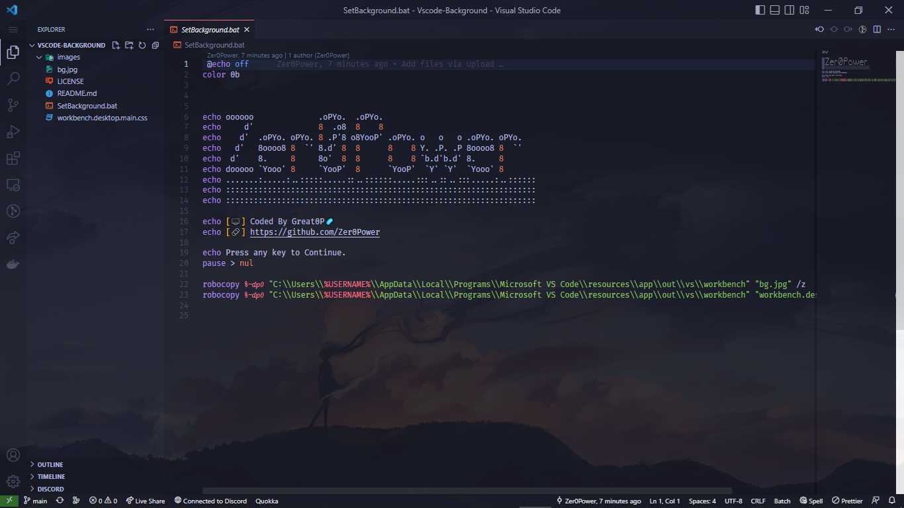

<!-- PROJECT LOGO -->
 

  

  <h3 align="center">VsCode Background</h3>

  

    batch Script to set VsCode Background
     
    <a href="https://github.com/Zer0Power/Vscode-Background"><strong>Explore the docs »</strong></a>
     
     
    <a href="https://github.com/Zer0Power/Vscode-Background">View Demo</a>
    ·
    <a href="https://github.com/Zer0Power/Vscode-Background/issues">Report Bug</a>
    ·
    <a href="https://github.com/Zer0Power/Vscode-Background/issues">Request Feature</a>
  

<!-- TABLE OF CONTENTS -->

  
Table of Contents

  <ol>
    <li>
      <a href="#about-the-project">About The Project</a>
    </li>
    <li>
      <a href="#getting-started">Getting Started</a>
      <ul>
        <li><a href="#installation">Installation</a></li>
      </ul>
    </li>
    <li><a href="#roadmap">Roadmap</a></li>
    <li><a href="#contributing">Contributing</a></li>
    <li><a href="#license">License</a></li>
    <li><a href="#contact">Contact</a></li>
  </ol>

<!-- ABOUT THE PROJECT -->
## About The Project

(<a href="#top">back to top</a>)

<!-- GETTING STARTED -->
## Getting Started

To Make your Vs code gorgeous follow these simple example steps.

### Installation
1. Choose your favorite background 
2. Replace it with `bg.jpg`
3. Run `SetBackground.bat` in your terminal
4. Restart your Vscode

(<a href="#top">back to top</a>)

<!-- ROADMAP -->
## Roadmap

See the [open issues](https://github.com/Zer0Power/Vscode-Background/issues) for a full list of proposed features (and known issues).

(<a href="#top">back to top</a>)

<!-- CONTRIBUTING -->
## Contributing

Contributions are what make the open source community such an amazing place to learn, inspire, and create. Any contributions you make are **greatly appreciated**.

If you have a suggestion that would make this better, please fork the repo and create a pull request. You can also simply open an issue with the tag "enhancement".
Don't forget to give the project a star! Thanks again!

1. Fork the Project
2. Create your Feature Branch (`git checkout -b feature/AmazingFeature`)
3. Commit your Changes (`git commit -m 'Add some AmazingFeature'`)
4. Push to the Branch (`git push origin feature/AmazingFeature`)
5. Open a Pull Request

(<a href="#top">back to top</a>)

<!-- LICENSE -->
## License

Distributed under the MIT License. See `LICENSE.txt` for more information.

(<a href="#top">back to top</a>)

<!-- CONTACT -->
## Contact

Project Link: [https://github.com/Zer0Power/Vscode-Background](https://github.com/Zer0Power/Vscode-Background)

(<a href="#top">back to top</a>)

